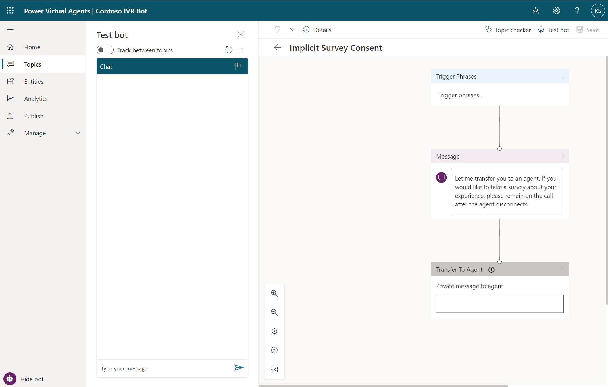
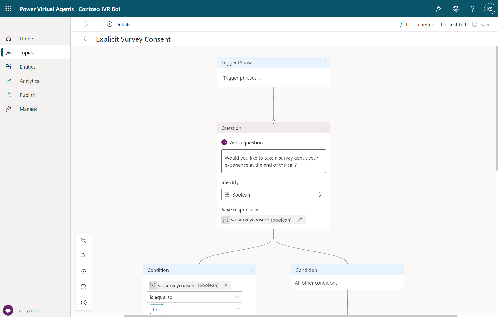
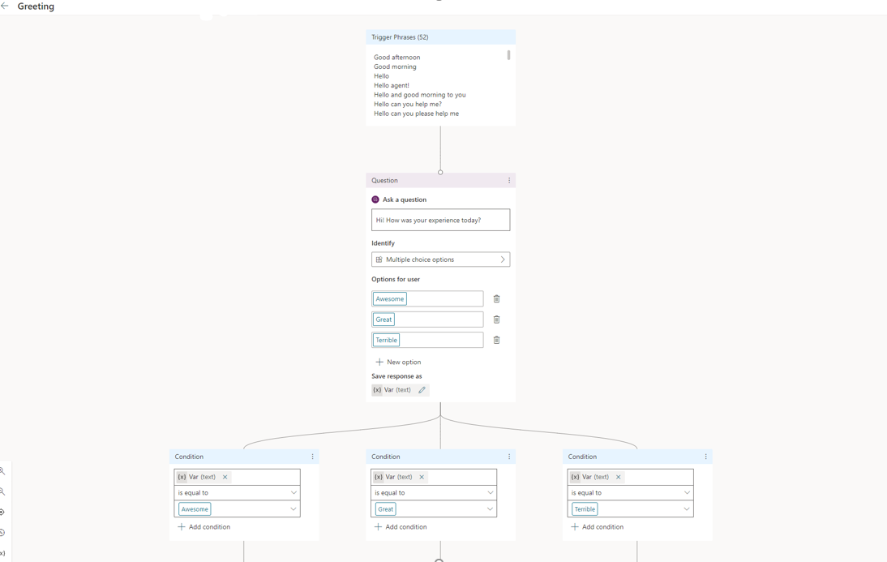
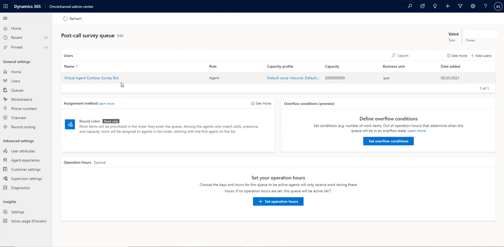
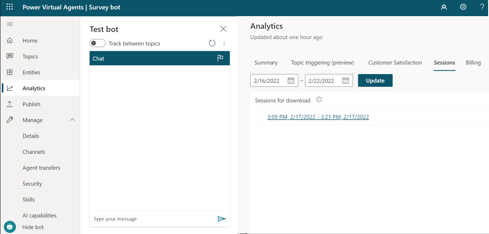

# Configure a post-call survey

[!INCLUDE[cc-feature-availability-embedded-yes](../../includes/cc-feature-availability-embedded-yes.md)]

[!INCLUDE[cc-rebrand-bot-agent](../../includes/cc-rebrand-bot-agent.md)]

Post-call surveys help measure customer satisfaction in the contact center. Surveys are also an incentive for is AI agents (agents) to provide high-quality service. You can configure the survey to take place immediately after the call so that customers can provide their feedback while the conversation is fresh on their minds.

The experience discussed in this article is for survey agents that you create in Copilot Studio. You can also configure a survey template in the admin center, which is the latest experience. Learn more in [Configure feedback surveys using Copilot Studio (preview)](/dynamics365/contact-center/administer/configure-surveys).

You can obtain customer consent for post-call surveys as follows:

- **Automatic - implicit**: The IVR agent informs the customer about a post-call survey at the end of the call. 
    After the agent disconnects, the call is automatically transferred to a post-call survey agent.
- **Automatic - explicit**: The IVR agent asks the customer if they want to participate in a post-call survey. The consent is saved in a `va_SurveyConsent` Boolean variable. If the customer consents, the call is automatically transferred to the post-call survey agent at the end of the call. If the customer says no, the call ends when the agent hangs up.
- **Agent-initiated**: Towards the end of a call, the agent can ask the customer if they want to take a survey.
    If the customer says yes, the agent manually transfers the call to the survey agent.

We recommend that you have two agents if your organization wants to use Copilot Studio for both IVR and survey scenarios.

## Create a survey agent in Copilot Studio

Use either Copilot Studio (no-code or low-code experience) or Azure bot Service (pro-developer experience).

You can add messages or questions in the **Escalation** topic to obtain a customer consent for a post-call survey. Examples of the messages are as follows:

### Implicit survey

> [!div class="mx-imgBorder"]
> 

### Explicit survey

> [!div class="mx-imgBorder"]
> 

> [!div class="mx-imgBorder"]
> 

### Configure a survey agent

You can add messages or questions to a Copilot Studio IVR agent to create a post-call survey. An agent greets the customer when the call routed to the survey queue is answered. Examples of messages or questions configured in the **Greetings** topic for the agent to greet the customer are as follows:

> [!NOTE]
> We recommend that you have two agents if your organization wants to use Copilot Studio for both IVR and survey scenarios.

> [!div class="mx-imgBorder"]
> 

> [!div class="mx-imgBorder"]
> 

> [!TIP]
> The agent author can use Power Automate to implement custom business logic to decide who receives a survey. For example, the agent might decide to survey someone random, VIP customers, and so forth.

## Connect your agent 

- Configure your Copilot Studio agent. Perform the steps in [Configure handoff to Contact Center](/power-virtual-agents/configuration-hand-off-omnichannel#configure-hand-off-in-the-power-virtual-agents-app) and [Integrate an AI agent](configure-bot-virtual-agent.md).
- Configure your Azure agent. Learn more in [Integrate an Azure bot](../configure-bot.md).

## Enable post-call survey in phone number settings

> [!Note]
> Enabling the post-call survey feature isn't required for the customer service representative (service representative or representative) initiated scenario.

To route the customer to the survey agent automatically after the agent hangs up, perform the following steps:

1. In the Copilot Service admin center or Contact Center admin center app, select your voice workstream, and then select **Edit** next to the pencil icon to modify the settings.
1. Under **Language**, scroll to the bottom of the dialog, and then toggle **Post-call survey** to **On**.
1. From the dropdown menu, select the survey agent.
1. Select **Confirm**.

## Set up agent-initiated survey

To enable agent-initiated feedback, create a queue where the only agent is the survey agent user.

   > [!div class="mx-imgBorder"]
   > 

### Try out the agent-initiated survey

Transfer the call to the survey queue.

   > [!div class="mx-imgBorder"]
   > 

When answered, this sends the user to the agent's greeting topic.

   > [!div class="mx-imgBorder"]
   > 

## View survey results

You can review the survey results on the **Analytics > Sessions** tab.

   > [!div class="mx-imgBorder"]
   > 

### Related information

[Introduction to the voice channel](voice-channel.md)  
[Outbound calling](voice-channel-outbound-calling.md)  
[Integrate an Azure bot](../configure-bot.md)  

[!INCLUDE[footer-include](../../includes/footer-banner.md)]
