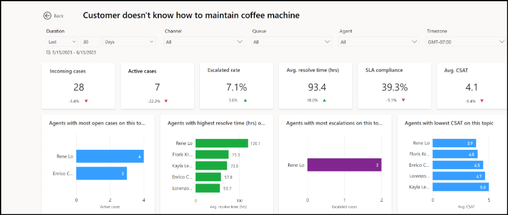

# Topics dashboard

The Topics dashboard shows a detailed breakdown of cases and their assigned topics. Customer Service Insights uses AI-generated topics and natural language understanding to automatically group your cases which helps you understand how different case types and topic areas affect your organization’s support performance.

To view the Topics dashboard, go to Customer Service historical analytics and select the **Topics** tab.

### Access the Topics dashboard

In the Customer Service workspace app, do one of the following to view the dashboard:

- In the default view, select the plus (+) icon, and then select **Customer Service historical analytics**.

- If the enhanced multisession workspace view is enabled, select the site map and then select **Customer Service historical analytics**.

On the page that appears, select the dashboard.

## Key insights card

The **Key insights discovered** card has three areas:

- Topics impacting resolution time
- Topics impacting CSAT
- Topics impacting survey sentiment

## Report details

The key performance indicators (KPIs) summary charts summarize the KPIs for the specified time period and the percentage of change over the period. You can filter these areas by duration, channel, queue, and customer service representative (service representative or representative).

The topics dashboard report shows the following KPIs.

| KPI     | Description     |
|------------|--------------|
| Incoming cases   |  The number of cases created to support customers.     |
| Active cases  |  The number of cases that are currently open.      |
| Escalated rate   | The percentage of cases that have been escalated.     |
| Avg. resolve time (hrs)   | The average time a representative took to resolve the case.   |
| SLA compliance | The percentage of cases that met the defined SLA.|
| Average CSAT    | The average customer satisfaction score, based on written feedback submitted by the customer in the Customer Voice survey.   |

The topic metrics chart shows the following metrics:

| Chart     | Description     |
|------------|--------------|
| Total cases |  The number of cases created to support customers.    |
| Occurrence by topic   | Percentage of cases classified to each given topic.   |
| Average resolution time  | Month over month trend of case resolution time in minutes.   |
| Average CSAT    | The average customer satisfaction score based on Customer Voice survey submitted by the customer.   |
| CSAT impact     | The amount that the given topic is driving the overall CSAT trend for the organization.     |
| Avg. survey sentiment   | The average sentiment score based on Customer Voice survey written feedback submitted by the customer.      |
| Survey sentiment impact    | The amount that the given topic is driving the overall sentiment trend for the organization.     |

### Case topics drill-down view

The case topics drill-down view provides supervisors with a holistic look into individual topics in reference to key business metrics, and can be valuable in understanding why end customers are contacting support.

To access the case topics drill down, select any metric value for the required topic, and then select **Details**.

> [!div class="mx-imgBorder"] 
> 

## Language availability for topics 

The topics capability in the Customer Service historical analytics reports comes with a natural language understanding model that can understand the text semantics and intent in the following languages: 

- English 
- French 
- German 
- Italian 
- Japanese 
- Portuguese 
- Simplified Chinese 
- Spanish 

> [!NOTE]
> While topic discovery isn't prevented and is still possible in languages that aren't listed above, there may be differences in what users experience if they leverage topics in unsupported languages.

### Related information

[Dashboard overview](customer-service-analytics-insights-csh.md)  
[Summary dashboard](summary-dashboard-cs.md)  
[Agent dashboard](agent-dashboard-cs.md)  
[Manage report bookmarks](manage-bookmarks.md)  

[!INCLUDE[footer-include](../../includes/footer-banner.md)]
