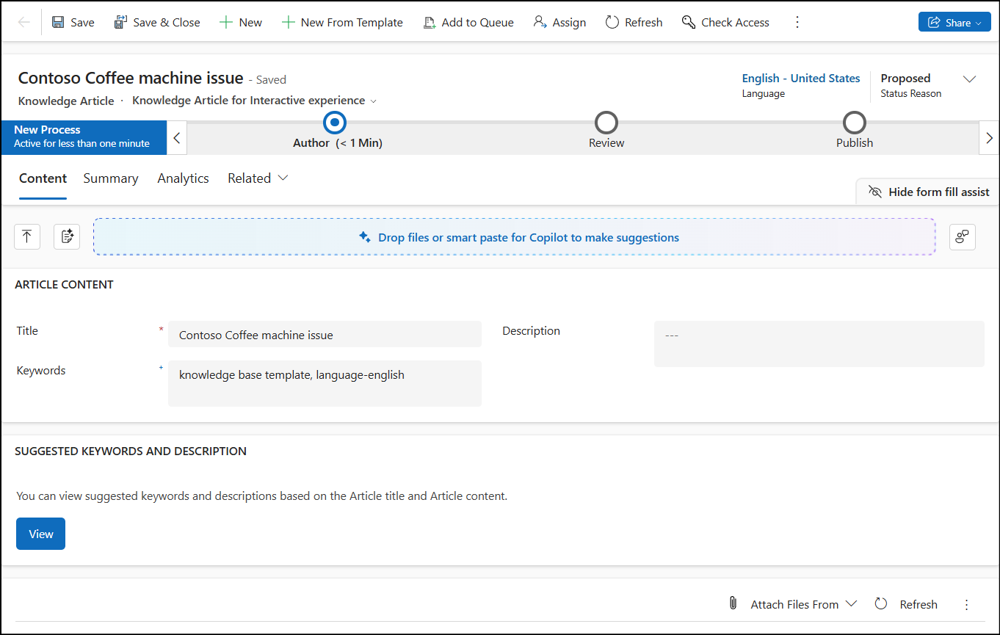

# Create templates for knowledge articles

[!INCLUDE[cc-feature-availability](../../includes/cc-feature-availability.md)]

Knowledge article templates help knowledge authors simplify the process of creating knowledge articles. Templates also help knowledge managers and authors maintain consistency in branding, language, and structure.

When an author chooses a template to create an article, certain fields in the template are prepopulated with values, allowing the author to focus on the main content of the article.

> [!NOTE]
> To learn how to use knowledge article templates to create knowledge articles, go to [Create knowledge articles using templates](customer-service-hub-user-guide-knowledge-article.md#create-knowledge-articles-using-templates).

## Prerequisites

Before working with templates, make sure you have the required privileges to create, edit, or delete knowledge article templates. Contact your administrator if you don't have these privileges.

## Create a knowledge article template

As a knowledge manager, you can create knowledge article templates by defining the necessary fields such as Language, Title, Keywords, and Subject. These fields are prepopulated when the author creates the article using the template, reducing the effort to fill in these fields.

You can create a knowledge article template in the Copilot Service admin center app by performing the following steps:

1. Go to the **Article Templates** section.

      1. In the site map, select **Knowledge** in **Support experience**. The **Knowledge** page appears.
      1. On the **Knowledge** page, go to the **Article Templates** section and select **Manage**.

1. Select **New**.

1. In the **Choose Language** dialog box, select the language for the template, and then select **OK**. In this example, we're selecting the language as **English – United States**.

    > [!div class=mx-imgBorder]
    > 
 
1. On the **New Knowledge Article Template** page, enter the values for the required fields that you want to prepopulate when the template is selected.

    |Section|Field|Description|
    |-------|-----|-----------|
    | **TEMPLATE DATA** | Name | Enter a name for the template. |
    || Owner | Enter the name of the owner who owns the template. By default, your name is displayed in this field. | 
    | **ARTICLE DATA** | `--` | Define article fields such as Title, Keywords, and Subject that are used in any knowledge article that’s created based on the template. |
    | **CONTENT** | `--` | Define a structure to be used in any knowledge article that’s created based on this template. Learn more in [Use the rich text editor to create knowledge articles and emails](customer-service-hub-user-guide-knowledge-article.md#use-the-rich-text-editor-to-create-knowledge-articles-and-emails). |

    > [!div class=mx-imgBorder]
    > 

1. After you enter the required information, select **Save**.

    A template is created and is available for knowledge authors to use to create articles.

> [!NOTE]
> Similarly, you can edit or delete knowledge article templates from the **Service Management** area.

## Use a template in Portal Knowledge Article Interactive Experience forms and custom forms

To add a knowledge article template to your forms, perform the following steps:

1. In Dynamics 365, go to **Settings** > **Advanced Settings** > **Customizations**.

2. Select **Knowledge Article Entity**, and then select **Forms**.

3. Open **Portal Knowledge Article Interactive Experience form**, and then select **Form Properties**.

4. Select **Add** to add the knowledge article template library that has the following web resource:

    ```
    msdyncrm_/KnowledgeManagementFeatureWebResource/KnowledgeArticleTemplate/KnowledgeArticleTemplateMainSystemLibrary.js
    ```

5. Under **Event Handlers**, make sure that the **Event** field is set to **Onload**.

6. Select **Add**. Ensure that the **Library** field is populated with the same web resource that you added.

7. In the **Function** field, add the following function:

    ```
    KnowledgeManagement.CommandBarActions.Instance.knowledgeArticle_onload
    ```

8. Ensure that the **Enabled** box is selected.

9. Select the **Pass execution context as first parameter** box, and then select **OK**.

10. Select **Save**, and then select **Publish**.

### Related information

[Create knowledge articles using templates](customer-service-hub-user-guide-knowledge-article.md#create-knowledge-articles-using-templates)


[!INCLUDE[footer-include](../../includes/footer-banner.md)]
