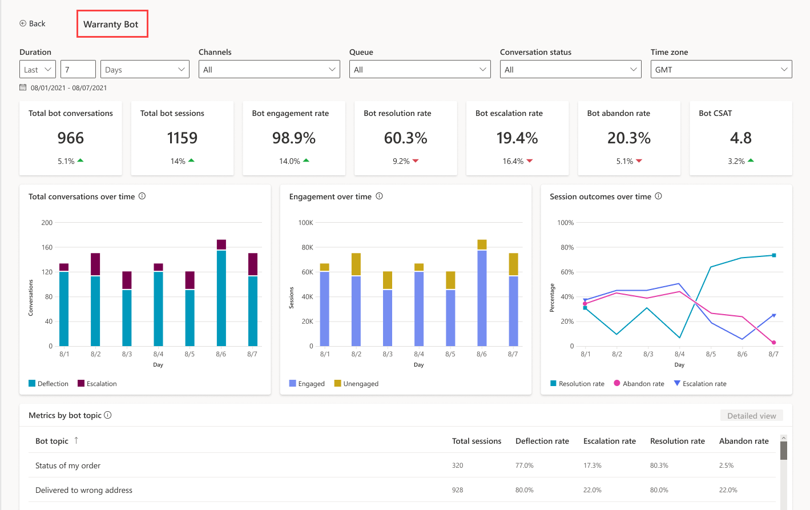
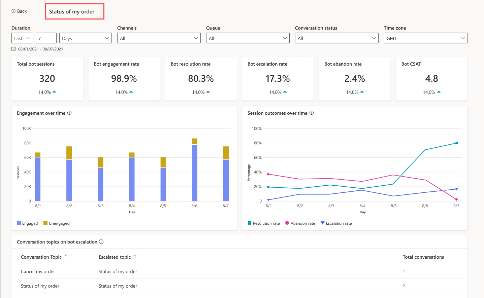
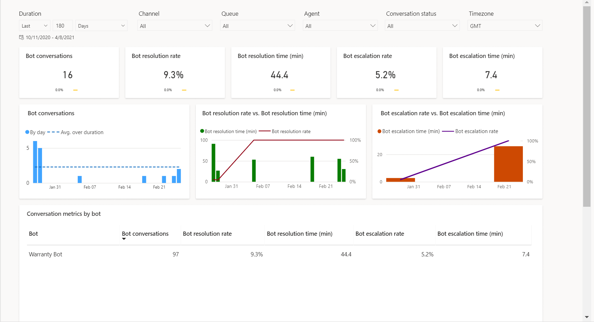

# Bot dashboard

[!INCLUDE[cc-feature-availability](../../includes/cc-feature-availability.md)]

[!INCLUDE[cc-rebrand-bot-agent](../../includes/cc-rebrand-bot-agent.md)]

In the application, you can integrate both Azure and Copilot agents to perform tasks like starting a conversation with the customer, providing automated responses, and then transferring the conversation to customer service representatives (service representatives or representatives), as required. The bot dashboard shows key performance indicators (KPIs) and charts for chat and IVR AI agents. You can use the dashboard to understand how AI agents are performing in a support organization. 

You can [access the dashboard](omnichannel-analytics-insights.md#access the dashboards) in the Copilot Service workspace or Contact Center workspace application.

Based on your administrator's configuration of the **Add historical analytics for bots** option in the Copilot Service admin center, the dashboard is as follows:
- **Enabled**: Indicates that your organization only has Copilot agents configured and the dashboard is specific to them. Additional metrics, charts, and KPIs that are applicable only to Copilot agents are displayed.
- **Disabled**: Indicates that your organization has both Azure and Copilot agents configured. The dashboard displays you metrics, KPIs, and charts that are common to both. 

## Prerequisites

- You must have the **Analytics Report Author** role to use the visual customizations in the bot dashboard. Visual customization is limited to the data available in the embedded Power BI report. If you want to add additional data, you need a Power BI license and enable data model customization.
- Make sure that **Allow conversation transcripts and their associated metadata to be saved in Dataverse** is selected in Power Platform admin center. This setting is required to save transcripts in Dataverse that the bot dashboard uses.

## [Copilot Studio bot dashboard](#tab/copilotstudiodashboard)

 The bot dashboard displays metrics specific to Copilot agents only if Copilot agents are integrated with Omnichannel for Customer Service and the **Add historical analytics for bots** checkbox in Copilot Service admin center is enabled.

  :::image type="content" source="../media/oc-bot-session-dashboard.png" alt-text="Screenshot showing the Omnichannel bot dashboard.":::

  ### Report details

 The report summarizes KPIs for the specified time period and the percentage change over that period. These metrics are specific to Copilot agents. You can filter these areas by duration, channel, queue, or service representatives.

  :::image type="content" source="../media/oc-bot-KPI.png" alt-text="Screenshot showing the Copilot Studio bot dashboard KPIs.":::

 | KPI | Description |
 | ------- | ------------------ |
 | Total bot conversations | The total number of conversations initiated during the selected time period involving AI agents across all supported channels: voice, chat, and digital messaging. This includes both active and closed conversations.|
 | Bot escalation rate | The percentage of AI agent conversations that were escalated by the AI agent to a service representative or an external phone number. |
 | Total bot sessions |  The total number of Copilot Studio sessions initiated during the selected time period. A session begins when the AI agent is triggered to handle a specific topic. A single conversation can include multiple sessions if the user engages with multiple topics. For example, if a customer uses the same AI agent to initiate both a return and an exchange, it counts as two sessions even though it's one conversation.|
 | Bot engagement rate |  The percentage of Copilot Studio sessions that moved into an engaged state. A session is considered engaged when any of the following conditions occur:<ul><li>A non-system topic is triggered</li><li>The session is escalated</li><li>The fallback topic is triggered</li><li>A conversational boosting topic is triggered</li></ul>
Learn more in [analyze agent performance and usage](/microsoft-copilot-studio/analytics-summary).|
 | Bot resolution rate | TThe percentage of Copilot Studio sessions that were resolved. A session is considered resolved when the End of Conversation topic is triggered and the user either confirms resolution, the session time out, or the Confirmed Success topic is triggered during the session. |
 | Bot abandon rate  | The percentage of engaged Copilot Studio sessions that were abandoned. A session is considered abandoned if it times out without reaching a resolved or escalated state. |
 | Bot CSAT | The graphical view of the average Customer Satisfaction (CSAT) score from users who responded to a survey at the end of a bot session. If this metric appears blank, AI agents may not be configured to request feedback through surveys. |

 The following table shows the bot KPI chart metrics.

  :::image type="content" source="../media/oc-bot-summary-charts.png" alt-text="Copilot Studio bot chart description.":::

 | Title | Description |
 | --------------- | ----------------- |
 | Total conversations | A graphical view of the total number of AI agent conversations with the number of escalated and deflected conversations over time. |
 | Engagement over time | A graphical view of the number of engaged and unengaged bot sessions over time. An engaged session is a session in which a user-created topic is triggered or the session ends in escalation. |
 |Session outcomes over time | A graphical view of the daily resolution rate, escalation rate, and abandon rate over the specified time period. | 

 ### Metrics by bot 

 The **Metrics by bot** section displays a comprehensive set of analytics that show you the key performance indicators. You can also view the trends and usage for your AI agent's topics at a granular level, highlighting the topics that have the greatest impact on your AI agent's performance.

 ### Summary

 The **Summary** tab gives you a broad overview of your AI agent's performance.

 :::image type="content" source="../media/oc-metrics-summary.png" alt-text="Screenshot that shows the bot summary.":::

 KPIs for the following areas are displayed.

 | Title | Description |
 | --------------- | --------------- |
 | Total conversations | The number of conversations initiated by the customer and engaged by an AI agent. |
 | Conversations escalated | The total number of conversations that were escalated to a service representative or an external number. |
 | Bot escalation rate | The percentage of conversations that were escalated by an AI agent to a service representative.|
 | Avg. escalation time (min) | The average time, in minutes, that a customer interacts with an AI agent before the conversation is escalated to a service representative or an external number. | 
 | Conversations deflected| The total number of conversations that were resolved by the AI agent without having to escalate it to a service representative. |
 | Bot deflection rate | The percentage of conversations that were closed by interacting with an AI agent, out of all conversations engaged by the same agent. |
 | Avg. resolution time (min) | The average time, in minutes, that a customer interacts with an AI agent before the conversation is closed.|
 | Bot CSAT | The customer satisfaction (CSAT) scores for AI agent-handled conversations where customers respond to an end-of-session survey request.|

 ### Details

 The **Details** tab gives you an insight into the bot sessions.

 :::image type="content" source="../media/oc-summary-details.png" alt-text="Screenshot that shows the bot details.":::

 KPIs for the following areas are displayed.

 | Title | Description |
 | --------------- | --------------- |
 | Total sessions| The total number of bot sessions within the specified time period. |
 | Bot sessions engaged | The number of engaged bot sessions the AI agent is engaged in within the specified time period. |
 | Engaged session rate| The percentage of bot sessions where the AI agent engages with the customer out of the total number of sessions within the specified time period. |
 | Bot sessions escalated | The number of bot sessions that are escalated to a service representative or an external number.|
 | Escalated session rate | The percentage of total bot sessions that were escalated by the AI agent to a service representative or an external phone number within the specified time period.| 
 | Bot sessions resolved| The number of engaged bot sessions that are resolved by the AI agent. |
 | Resolved session rate | The percentage of total bot sessions that were resolved by the AI agent within the specified time period.| 
 | Bot sessions abandoned|The number of engaged bot sessions that are abandoned. An abandoned session is an engaged session that is not resolved or escalated after one hour from the beginning of the session.|
 | Abandoned session rate | The percentage of total bot sessions that were abandoned within the specified time period.| 
 | Bot sessions per conversation | The average number of AI agent sessions per conversation. | 

 ### Bot drill-down view

 In the **Metrics by bot** section, you can select a Copilot agent to view the individual AI agent's performance on the bot drill-down view. Bot topics and their corresponding metrics are also displayed, giving supervisors further insights into individual topic performance. 

 To access the drill-down view, select the AI agent that you're interested in, and then select **Detailed view**.

 The application displays the key performance metrics and charts for the individual AI agent.
 > [!div class="mx-imgBorder"]
 > 

 | Title | Description |
 | --------------- | --------------- |
 | Total conversations | The number of conversations initiated by the customer and engaged by the bot. |
 | Total sessions | The total number of bot sessions within the specified time period. A bot session is defined as a conversation in which an AI agent is invoked. The AI agent can be invoked at the beginning, during, or end of a conversation. |
 | Engagement rate | The percentage of total bot sessions that are engaged by the AI agent. An engaged session is a session in which a user-created topic (as opposed to a system topic) is triggered, or the session ends in escalation. Engaged bot sessions can have one of three outcomes—they're either resolved, escalated, or abandoned. |
 | Resolution rate | The percentage of engaged bot sessions that are resolved. A resolved session is an engaged session in which the user receives an end-of-conversation survey that asks the question "Did that answer your question?" and the user either doesn't respond or responds **Yes**.|
 | Escalation rate | The percentage of engaged bot sessions that are escalated by the AI agent. An escalated session is an engaged session that is escalated to a service representative or an external phone number. | 
 | Abandon rate | The percentage of engaged bot sessions that are abandoned. An abandoned session is an engaged session that isn't resolved or escalated after one hour from the beginning of the session.|
 | Bot CSAT | The average of customer satisfaction (CSAT) scores for bot sessions in which customers respond to an end-of-session request to take the survey. | 

 The following charts are displayed:

 | Title | Description |
 | --------------- | --------------- |
 | Total conversations over time | The number of conversations initiated by the customer and engaged by the AI agent that were either escalated or deflected. |
 | Engagement over time | Provides a graphical view of the number of engaged and unengaged bot sessions over time. An engaged session is a session in which a user-created topic is triggered or the session ends in escalation. |
 | Session outcomes over time | Provides a graphical view of the daily resolution rate, escalation rate, and abandon rate over the specified time period.|

 ### Metrics by bot topic

 The **Metrics by bot topic** section provides insights into the performance of individual bot topics and their key business metrics. The metrics give the supervisor an overview of which topics the AI agent was able to deflect or escalate. 

 You can also select a topic and drill down into the individual topic performance and metrics. The topic-level metrics help supervisors further analyze how the AI agent is handling the topic. 

 > [!div class="mx-imgBorder"]
 > 

 The **Bot conversation metrics** section provides the topic transcripts, allowing supervisors to go through the AI agent's interactions for the topic and take corrective measures.

 ### View and improve bot topics

 You can view and improve the performance of individual topics associated with a Copilot agent by performing the following steps:

 1. On the bot drill-down page, for an AI agent, select the topic to view the topic-specific metrics. 
   You can also view and download up to seven days of bot conversation transcript sessions from the past 30 days.
   > [!div class="mx-imgBorder"]
   >  

 ### Customize bot dashboard

For Copilot agents, you can edit the report to add the additional metrics and filters to the AI agent. To customize the bot dashboard, see [customize visual display](/dynamics365/contact-center/use/customize-agent-dashboard?toc=/dynamics365/customer-service/use/toc.json&bc=../../breadcrumb/toc.yml). 

## [Dashboard for all bots ](#tab/allbots)

 The **bot** dashboard summarizes the KPIs for all the AI agents integrated with the application for the specified time period and percent change over a period. The application displays this view only if your administrator has disabled the **Add historical analytics for bots** checkbox in Copilot Service admin center. You can filter these areas by duration, channel, queue, or service representative.

 > [!div class="mx-imgBorder"]
 > 

 ### Report details

 KPIs for the following areas are displayed.

 | KPI | Description |
 | ------- | ------------------ |
 | Bot conversations | The number of conversations initiated by the customer and engaged by an AI agent. |
 | Bot resolution rate | The percentage of conversations that were closed by interacting with an AI agent out of all conversations engaged by the same agent. |
 | Bot resolution time (min) | The time in minutes for which a customer interacted with an AI agent before the conversation was closed. |
 | Bot escalation rate | The percentage of conversations that were escalated by an AI agent to a service representative or an external phone number. |
 | Bot escalation time (min) | The time in minutes for which a customer interacted with an AI agent before the conversation was escalated to a service representative or an external phone number. |

 > [!div class="mx-imgBorder"]
 > 

 The following table explains the bot KPI chart metrics.

 | Title | Description |
 | --------------- | ----------------- |
 | Bot conversations | The total number of bot conversations occurring per day. |
 | Bot resolution rate versus Bot resolution time (min) | The number of customer issues resolved by an AI agent versus the amount of time it took to resolve them. |
 | Bot escalation rate versus Bot escalation time (min) | The number of customer sessions escalated by an AI agent to a service representative versus the amount of time the AI agent was engaging before escalation. | 

 | Title | Description |
 | --------------- | --------------- |
 | Bot conversations | The number of conversations initiated by the customer and engaged by an AI agent. |
 | Bot resolution rate | The percentage of conversations that were closed by interacting with an AI agent out of all conversations engaged by the same agent. |
 | Bot resolution time | The time in minutes for which a customer interacted with an AI agent before the conversation was closed. |
 | Bot escalation rate | The percentage of conversations that were escalated by an AI agent to a service representative or an external phone number. |
 | Bot escalation time (min) | The time in minutes for which a customer interacted with an AI agent before the conversation was escalated to a service representative or an external phone number. | 

 ### Bot hourly detail drill-down view

 The **Bot metrics by hour** drill-down view provides more granular insight into the hour-by-hour breakdown of key conversation metrics within the contact center. The metrics are the same as the day-by-day view ensuring that supervisors can consistently analyze their contact center operation regardless of desired duration granularity. To view the bot metrics by hour in the drill-down view, select any single metric value on the desired day, then select **Hourly details**.

 > [!div class="mx-imgBorder"]
 >  

---

### Related information

[Conversation dashboard](oc-conversation-dashboard.md)  
[Dashboard overview](customer-service-analytics-insights-csh.md)  
[Queue dashboard](oc-queue-dashboard.md)  
[Conversation Topics dashboard](oc-conversation-topics-dashboard.md)  
[Manage report bookmarks](manage-bookmarks.md)  

