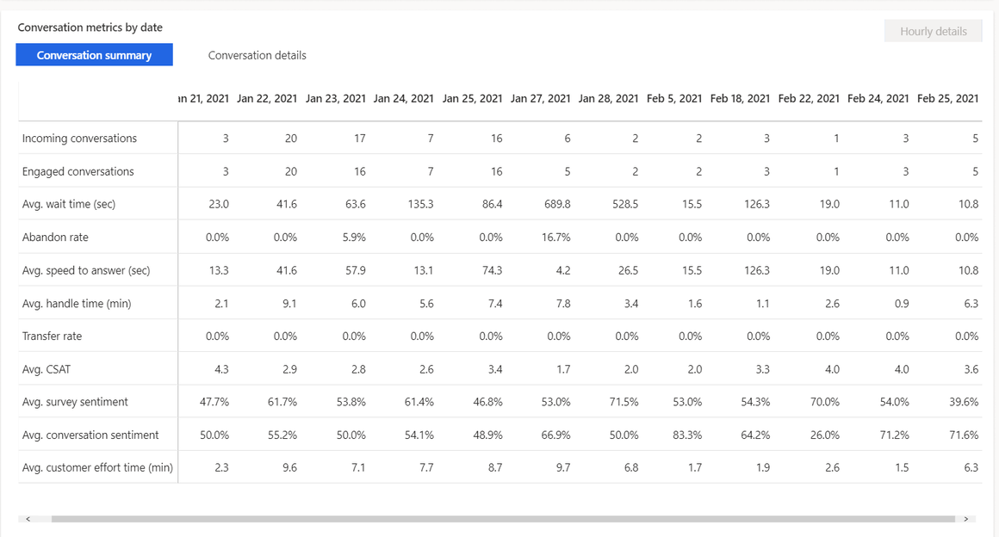
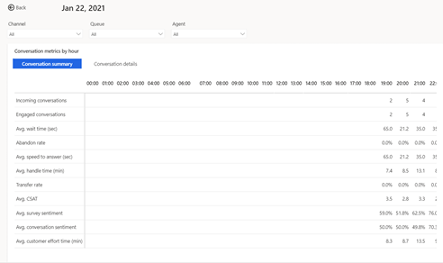

# Conversation dashboard

[!INCLUDE[cc-feature-availability](../../includes/cc-feature-availability.md)]

The Conversation dashboard gives you a broad overview of the customer service experience in your organization. It uses AI to surface insights into the topics that generate the highest volume and the topics that are emerging with the fastest increase in volume.

> [!div class="mx-imgBorder"]
> 

The dashboard includes various charts with graphical views of your organization's key performance indicators (KPIs).

The charts for conversation volume drivers and emerging conversation volume by topic charts use natural language understanding to group support conversations as topics that are a collection of related conversations. These charts display the customer support topics that generate the most volume and emerging topics that increase rapidly in volume. This helps you identify areas of improvement that can affect support performance.

By default, the dashboard shows you the KPIs for the past month and for all channels, queues, and customer service representatives (service representatives or representatives) in your system. You can use the data filtering options to select data for a specific time period, channel, queue, service representative, conversation status, and timezone.

> [!NOTE]
> If you switch to a different dashboard, the filter you specified persists, and is applied to the data on all dashboards.

## Report details

The conversation lifecycle and the metrics that can be derived in the different statuses is represented in the following diagram.

:::image type="content" source="../media/conversation-lifecycle-metrics-diagram.png" alt-text="Diagrammatic representation of the conversation lifecycle and the metrics that can be derived." lightbox="../media/conversation-lifecycle-metrics-diagram-large.png":::

The following table lists the KPIs in the Conversation dashboard.

| Metric | Description | Derivation |
| -------- | --------------------- | --------------------------- |
| Incoming conversations | The number of conversations initiated by the customer that can be presented to a service representative. | All conversations are considered, except bot conversations. |
| Engaged conversations | Offered conversations that are engaged by a service representative. Customer-to-agent communication can begin at this point. | All conversations are considered. |
| Abandon rate | The percentage of conversations that aren't engaged by service representatives.| All conversations are considered. |
| Avg. speed to answer (seconds) | The average time customers waited in the queue before connecting to a service representative. (Time taken for acceptance) | Conversations engaged and conversations that are in the closed state are considered. |
| Avg. CSAT | The average of the customer satisfaction ratings provided by customers. Only available if Dynamics 365 Customer Voice is configured as a post-conversation survey tool. ||
| Avg. conversation sentiment | The average sentiment score based on the customer's conversation experience. Learn more about how the sentiment data is derived in [Monitor real-time customer sentiment](oc-monitor-real-time-customer-sentiment-sessions.md). ||

> [!div class="mx-imgBorder"]
> 

Conversation charts appear as shown in the following image.

> [!div class="mx-imgBorder"]
> 

The KPIs in the conversation chart are as follows.

| Title | Description |
| -------------------- | ----------------- |
| Incoming conversations vs. engaged conversations | The number of conversations initiated by the customer versus the number of conversations that are accepted and engaged by service representatives. |
| Incoming conversations by channel | The number of conversations initiated by the customer and presented to a  service representative, sorted by channel. |
| Avg. CSAT | The average of the customer satisfaction ratings provided by customers. Only available if Dynamics 365 Customer Voice is configured as a post-conversation survey tool.  |
| Abandon rate | The trend in percentage of conversations that aren't engaged by service representatives, by day. |
| Avg. speed to answer (sec) | The average time customers waited in the queue before connecting to a service representative. (Time taken for acceptance). |
| Avg. conversation handle time (min) | The average total conversation active time across engaged conversations. |
| Avg. customer effort time (min) | The average time from the start of a conversation to the start of the conversation wrap-up time. |
| Avg. conversation sentiment | The average of predicted customer sentiment in a given timeframe for a set queue or service representative, which indicates the degree of positive sentiment that customers expressed at the end of their interaction. |
| Conversations with secondary channel | The breakdown of conversations across secondary channels. |
| Top 10 volume topics | The top 10 AI-discovered topics from conversation data sorted by conversation volume.|
| Emerging conversation volume by topic | The top emerging AI-discovered topics, from conversation data that featured the greatest increase in volume over the duration being evaluated. |

> [!div class="mx-imgBorder"]
> 

The KPIs for the conversation summary are as follows.

| Conversation summary | Description |
| ------------------------ | --------------------- |
| Incoming conversations | The number of conversations initiated by the customer and can be presented to a service representative. |
| Engaged conversations | Offered conversations that are engaged by a service representative. Customer-to-representative communication can begin at this point. |
| Avg. wait time (sec) | The average time customers waited before connecting to service representatives. This average is similar to "speed to answer" but includes wait time from each session within a conversation. |
| Abandon rate | The percentage of conversations that aren't engaged by service representatives. |
| Avg. speed to answer (sec) | The average time customers waited in the queue before connecting to a service representative (Time taken for acceptance). |
| Avg. handle time (min) | The average total conversation active time across engaged conversations. |
| Transfer rate | The percentage of conversations that are transferred to another service representative or queue. |
| Avg. CSAT | The average of customer satisfaction ratings provided by customers. Available only if Dynamics 365 Customer Voice is configured as a post-conversation survey tool. |
| Avg. survey sentiment | The average of customer sentiment based on verbatim provided in survey responses. Available only if Dynamics 365 Customer Voice is configured as a post-conversation survey tool. |
| Avg. conversation sentiment | The average of predicted customer sentiment in each timeframe for a set queue or service representative, which indicates the degree of positive sentiment that customers expressed at the end of their interaction. |
| Avg. customer effort time (min) | The average time from the start of the conversation to the start of the conversation wrap-up time. |

The following table displays the conversation details and their descriptions.

| Conversation details | Description |
| -------------------- | ------------------- |
| Avg. session per conversation | The average number of sessions in each conversation. |
| Avg. conversation time (min) | The average total time to complete conversations across engaged conversations. |
| Avg. time for first response (min) | The average total time for first responses across engaged conversations. |
| Avg. response time (min) | The average total time for first responses on conversations.  |
| Avg. conversation active time (min) | The average time that conversations remain active across engaged conversations. |
| Avg. conversation inactive time (min) | The average time that conversations remain inactive across engaged conversations. |
| Avg. conversation wrap-up time (min) | The average time that conversations take to wrap up across engaged conversations. |
| Avg. incoming messages | The average of the total number of messages sent by customers.  |
| Avg. outgoing messages | Average of the total number of messages sent as a response from a service representative. This average doesn’t include any consult or monitoring messages a supervisor or team lead sent to a service representative. |
| Incoming messages | The average of the total number of messages sent by customers|
| Outgoing messages | The average of the total number of messages sent as a response from a service representative. This average doesn’t include any consult or monitoring messages that a supervisor or team lead sent to a service representative. |

## Conversation hourly details drill down view

The Conversation hourly details drill down view provides granular insight into the hour-by-hour breakdown of key conversation metrics within the contact center. The metrics for conversation summary and conversation details metrics are the same as the day-by-day view, ensuring that supervisors can consistently analyze their contact center operation regardless of desired duration granularity.  

To view the drill-down, select any single metric value for the day you're interested in, and then select **Hourly details**.  

> [!div class="mx-imgBorder"]
> 

### Related information

[Dashboard overview](customer-service-analytics-insights-csh.md)  
[Agent dashboard](agent-dashboard.md)  
[Bot dashboard](oc-bot-dashboard.md)  
[Manage report bookmarks](manage-bookmarks.md)  
