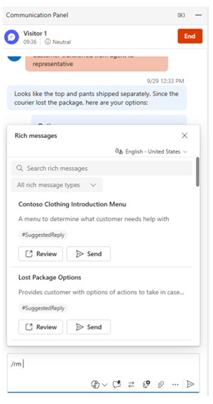

# Send rich messages

After an administrator creates rich message templates, customer service representatives (service representatives, representatives) can edit and send these interactive templates to customers to collect and share information more easily. Regardless of channel type, you can send rich messages using either of the following methods:

- Select **Rich messages** to launch the rich message panel.

   > [!div class=mx-imgBorder]
   > 
  
- Use the **/rm** keyboard command to see the list of rich messages.
   
## Search for rich messages and tags

After customer service representatives launch the rich message panel by selecting the rich message icon or typing /rm, they can use the search bar and rich media message type filters to find relevant rich messages to send.

   > [!div class=mx-imgBorder]
   > 

Optionally, they can also use the following keyboard shortcuts:
   
   - Type "/rm", followed by &lt;keyword&gt;, to list messages that match the keyword. 
   - Type "/rm", followed by the number sign (#), to list all tags. All rich messages have a tag containing their type. 
   - Type "/rm", followed by &lt;tagname&gt;&lt;keyword&gt;, to list quick replies that match the tag and keyword.
   - Type "/rm", followed by &lt;tagname&gt;, to list all rich messages that match the tag. Additionally, you can also add another tag after the &lt;tagname&gt;. For example, type "/rm", followed by &lt;tagname&gt; &lt;tagname&gt;, to further refine the rich messages matching both the tags.

## View and send rich messages

When you find the rich message you want to send, you can select it to open it in the **Rich Message Preview** application pane.

   > [!div class=mx-imgBorder]
   >    

Within the preview tab, you can see the contents of the rich message that you selected. When you’re ready to send the rich message, select **Send Message**.

If your administrator enabled the customer service representative (service representative or representative) configuration, you can customize some types of rich messages before you send them. These customizations are single-use and aren’t saved for the next time you send the same rich message. 

The following rich messages support admin-enabled customization:

| Channel | Message type |
|---------|---------------|
| Live chat (preview) | Suggested replies  Cards/carousels  Forms  Suggested replies|
| WhatsApp (preview) | Suggested replies |
| Apple Messages for Business | [List picker](../administer/create-rich-messages.md#list-picker)  [Suggested reply](../administer/create-rich-messages.md#suggested-reply)  [Time picker](../administer/create-rich-messages.md#time-picker)  [Video rich link](../administer/create-rich-messages.md#video-rich-link)  [Website rich link](../administer/create-rich-messages.md#website-rich-link)  |

### Related information

[Retrieve and format rich messages](../develop/reference/methods/message-object.md)  
[Manage rich messages](../administer/create-rich-messages.md)  
[Understand and create workstreams](../work-streams-introduction.md)  
[Configure automated messages](../administer/configure-automated-message.md)  
[Configure a post-conversation survey](../administer/configure-post-conversation-survey.md)  
[Skill-based routing](../administer/overview-skill-work-distribution.md)  
[Create message templates](../administer/create-message-templates.md)  
[Templates](/dynamics365/app-profile-manager/templates-overview)  
[Delete a configured channel](../administer/delete-channel.md)  
[Support for live chat and asynchronous channels](../administer/card-support-in-channels.md)  

[!INCLUDE[footer-include](../../includes/footer-banner.md)]
