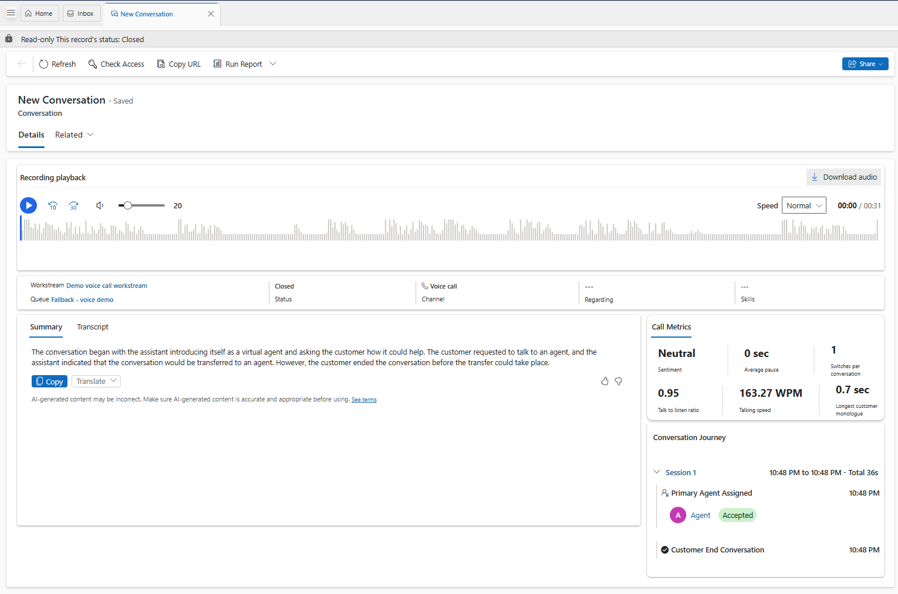

# View call recordings and transcripts

[!INCLUDE[cc-feature-availability](../../includes/cc-feature-availability.md)]

If your administrator has enabled the option to view call recordings and transcripts, when conversations between agents and customers end, both supervisors and agents can view the recordings and transcripts of those conversations, play back the recordings, and view the sentiment analysis and other analytics related to the conversations.

> [!NOTE]
> Many countries and states have laws and regulations that apply to the recording of public switched telephone network (PSTN), voice, and video calls, and may require that users first consent to the recording of their communications. It is your responsibility to use the call recording capabilities in compliance with the law. Before using call recording features, you must obtain consent from the parties of recorded communications in a manner that complies with all applicable laws for each participant.

## Introduction

As an agent, you can access the recordings and transcripts for completed calls by accessing the closed conversations in one of the following ways:

- If the form selector is available, on your session window, select the dropdown button for **Active Conversation** and select **Closed Conversation**.
- 
- Select the name of the contact, and then in the **Timeline** section, hover the mouse over the closed conversation that you want to view, and then select the **Open Record** icon.

> [!NOTE]
> Users with the System Administrator role can access conversations that are handled by other agents.

## Call recording and transcript controls

The **Details** tab of the **Conversation - Conversation Form** displays the call recording details.

> [!div class="mx-imgBorder"]
> 

**Recording playback**

- **Play**: Select the button to listen to the conversation audio.
- **Rewind** or **Fast-forward**: Select the buttons to either rewind in 10-second increments or fast-forward in 30-second increments.
- **Volume**: Move the slider to adjust the volume to your desired level.
- **Download audio**: Download an .mp4 audio file of the complete conversation.
- **Speed**: From the dropdown menu, select the playback speed of the conversation, whether slower or faster. **Normal** is the default, and is the speed in which the conversation was recorded.
- **Conversation scroll bar**: Move the scroll bar to any point of the conversation, or listen to it from beginning to end. When you select a location in the recording visualization, the transcript also moves to same place in the conversation.
- **Sentiment**: Colors and emojis help you quickly analyze the sentiment of the conversation. Green indicates positive sentiment, red indicates negative sentiment, and grey indicates neutral sentiment.

**Transcript**

- **Search**: Enter keywords in the search field to locate desired sections of conversation.
- **Download transcript**: Open an HTML file of the conversation transcript in your browser.
  
   > [!NOTE]
   > Inline images and rendering of videos is not supported in downloaded transcripts.

The **Overview** section of the Conversation Form displays the following details:

- **Primary agent**: The name of the agent who conducted the call.
- **Customer**: The name of the customer the call was with.
- **Channel**: The type of communication conducted.
- **Sentiment**: The average sentiment of the call.
- **Status**: The state of the communication.
- **Status reason**: The reason for the status of the call.
- **Queue**: The queue the call was conducted in.
- **Workstream**: The workstream the call was conducted in.
- **Duration**: The total amount of time of the call, from start to finish.
- **Skills**: The list of agent skills.
- **Regarding**: The link to the customer record.
- **Last modified**: The date and time that the call was last edited.

The **Metrics** tab of the Conversation Form displays the following details:

- **Talking speed**: The rate of speed in which participants conversed during the call.
- **Talk to listen ratio**: The ratio in which the agent spoke versus listened to the customer.
- **Average pause**: The average amount of time in which the conversation was paused.
- **Longest customer monologue**: The longest amount of time that the customer spoke during the conversation.
- **Switches per conversation**: The number of times the conversation switched from agent to customer, and vice versa.

The **Sessions** tab displays details about the number of voice calls between the agent and the customer, and the duration, date, and time of the conversation.

### See also

[Agent experience of voice calls and agent dashboard](voice-channel-agent-experience.md)  
[Call a customer](voice-channel-call-customer.md)  
[View and understand call summary page in the Sales Hub app](../../sales/view-and-understand-call-summary-sales-app.md)  
