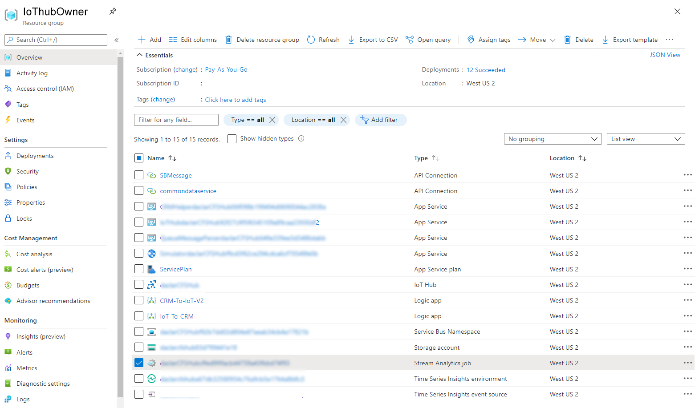
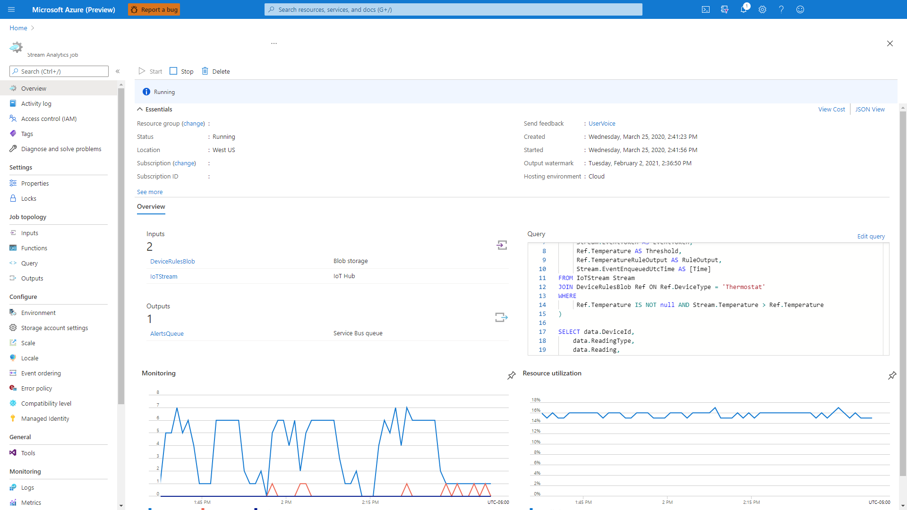
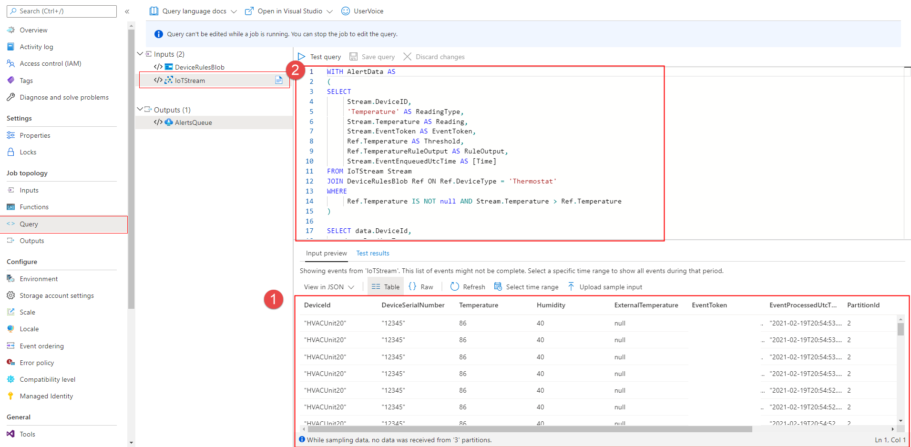
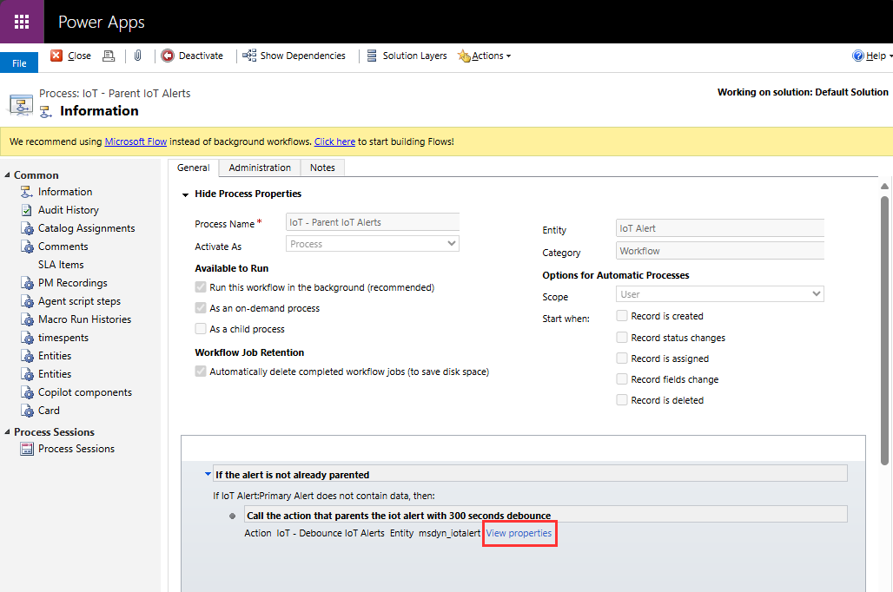

# Create IoT alerts and convert IoT alerts into work orders

In Dynamics 365 Field Service, Internet of Things (IoT) alerts are a subset of IoT messages that might require attention. For example, a configured sensor in a refrigerator that you service sends an alert that the humidity is above an acceptable threshold. To help with proactive service delivery, you can convert that incoming IoT alert to a work order, which can then be scheduled and assigned to a service technician.

This article explains the following things:

- How IoT alerts are triggered
- How to see IoT alerts in Field Service
- How to create work orders based on the IoT alerts

For a guided walkthrough, see the following video:  [Connected Field Service: IoT Alerts](https://youtu.be/tkBSLhKNfmQ). 

## Trigger IoT alerts in Azure IoT Hub

As IoT device information flows into Azure IoT Hub, you can create rules that dictate when IoT alerts should be created based on the IoT messages.

1. Sign in to Microsoft Azure and select your resource group.

   > [!div class="mx-imgBorder"]
   > 

1. Find and edit the **Stream Analytics job**.

   > [!div class="mx-imgBorder"]
   > 

1. Select **Query** in the left pane, then select **IoTStream**.

   > [!div class="mx-imgBorder"]
   > 

   With reference to the callouts in the previous image:

   - **(1)**: The bottom pane shows all incoming IoT messages from the connected device.
   - **(2)**: The top pane shows the JSON that creates the IoT alerts from the IoT messages.

### Trigger IoT alerts with the simulator

Set up the simulator to simulate IoT devices and data so that device data is pulled into Field Service.

1. To find the simulator URL, sign in to your Azure subscription, and then select the app service resource type under the newly created resource group.

   > [!div class="mx-imgBorder"]
   > 

1. The URL appears in the top-right corner. Copy the URL. 

   > [!div class="mx-imgBorder"]
   > 

1. Paste the URL into your browser’s address bar to load the page.  
  
1. When the simulator page opens, select **Connection** at the top.  
  
1. Enter the IoT hub host name and key. The host is the name of the IoT Hub resource in the Azure portal. 

   > [!div class="mx-imgBorder"]
   > 

1. To access the key, select the IoT Hub resource and go to the shared access policies. Then, copy the primary key for **iothubowner**.

   > [!div class="mx-imgBorder"]
   > 
  
1. Select the IoT hub in the **Resource Group**.  
  
1. On the left under **General**, select **Shared access policies** to get the host name and primary key.  
  
1. Ensure **Connection status** is marked as **Connected** and then close the dialog box.  

1. Send a test command by using the sample simulator. For example, select the temperature and increase it to above 70 degrees. The simulator is preprogrammed to create an IoT alert if the temperature is above 70 degrees.

   > [!div class="mx-imgBorder"]
   > 

   > [!Note]
   > **Not using Azure IoT Hub?** Creating IoT alerts in Field Service based on IoT messages in your custom IoT provider is supported. For more information, see this article: [Extensible IoT data sources for Connected Field Service](cfs-custom-iot-provider.md). 

   After the rule is created in Stream Analytics, the logic app creates IoT alerts based on the rule criteria. 

   > [!div class="mx-imgBorder"]
   > 

## View IoT alerts in Field Service

In our example with the simulator, an IoT alert was created in Field Service because the temperature reading in an IoT message exceeded 70 degrees.

1. In Dynamics 365 Field Service, under **Assets**, select **IoT Alerts**.

   :::image type="content" source="media/cfs-iot-alert-from-simulator.png" alt-text="Screenshot of all active IoT alerts in Field Service, highlighting one.":::

1. Open an alert. The **Alert Data** section shows the details in the JSON message.

## Convert an IoT alert to a work order

To take action against the IoT alert, use the business process flow.

1. In Dynamics 365 Field Service, under **Assets**, select **IoT Alerts**.

1. Open an alert. The business process flow appears at the top of the page.

1. Create a case to investigate remotely. Select **Created** > **Next Stage** > **Create**.

   :::image type="content" source="media/cfs-iot-alert-next-stage.png" alt-text="Screenshot of an open IoT alert in Field Service, showing the business process flow for create a case.":::

1. Select **Save & Close**. The **Case** page appears.

1. If the potential issue can't be identified or resolved remotely, advance to the next step in the business process flow to create a work order. Select **Create Case** > **Next Stage** > **Create**.

1. Enter the information for the work order.

1. Select **Save & Close**. The **Work Order** page appears. The IoT alert is referenced on the work order form. The technician can see it on their mobile device.

1. If applicable, you can schedule the work order.

## Organize IoT alerts

Multiple IoT alerts might be created for the same IoT device for the same issue. The system recognizes similar IoT alerts and groups them together.

1. In Dynamics 365 Field Service, under **Assets**, select **IoT Alerts**. The hierarchy icon identifies a group of similar alerts.

   :::image type="content" source="media/cfs-iot-alert-parent-diagram.png" alt-text="Screenshot of Field Service IoT alerts, showing an icon that indicates similar alerts.":::

1. Select the hierarchy icon next to an IoT alert to see similar IoT alerts for the same device around the same time.

   :::image type="content" source="media/cfs-iot-alert-parent1.png" alt-text="Screenshot of related IoT alerts in Field Service.":::

You can also use AI to suggest which IoT alerts are higher priority based on historical data, such as which IoT alerts were converted to work orders. Learn more: [IoT alert AI suggestions](iot-alerts-ai-based-suggestions.md).

## Configure parent IoT alert settings

When an IoT alert is created in Connected Field Service, aggregation rules determine if the alert should be parented under another existing alert. The alert might be for a device or asset that already has an open alert. With autoparenting, you can avoid overrunning the alert list with too many alerts for the same issue.

Configure which fields should be used to decide if an alert should be parented.

1. In Dynamics 365 Field Service, select the **Settings** area.

1. Under **IoT**, select **IoT Settings** > **Alert Aggregation Rules**.

   :::image type="content" source="media/iot-alert-parenting-1.png" alt-text="IoT settings in Field Service, on the Alert Aggregation Rules tab.":::

1. Select the fields to use to group similar IoT alerts, if any.

   If an alert matches all the selected fields and the alert time falls within five minutes of the previous alert, the alert is parented. If you disable all the fields, the default setting applies. The default parents an alert if the device ID matches another alert and the alert time falls within five minutes.

   If the alert time field doesn't have a value, the system uses the **Created On** field on the IoT alert record to make sure it falls within five minutes of other matching alerts.

### Change or disable parent settings

When a parent alert is found, the system checks to see if the matched alert has a parent, in which case the new alert is linked to the existing parent alert. If the matching alert doesn't have a parent, the new alert is linked to the matching alert, which becomes the parent alert.

To make the five-minute rule longer or shorter, modify the workflow "debounce" period.

<!--- How do I get to this screen? 
 
And what does workflow or flow depending on enhanced background processing mean? --->

To completely turn off the autoparent feature, disable the workflow or flow depending on whether your organization uses enhanced background processing controlled through Field Service settings. For more information, see this [article on default settings in Field Service](/dynamics365/field-service/configure-default-settings#other-settings).

