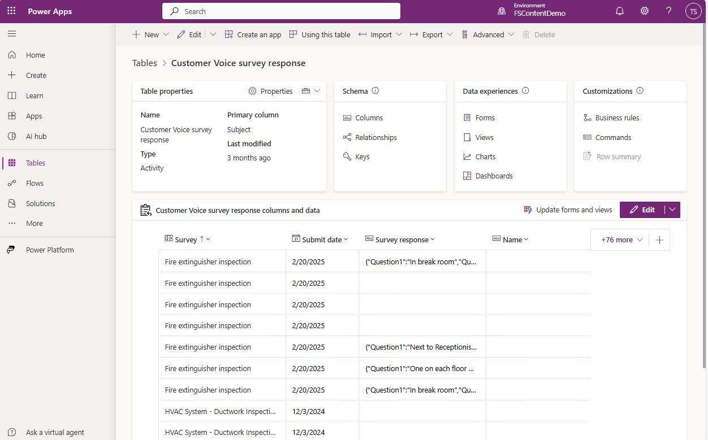
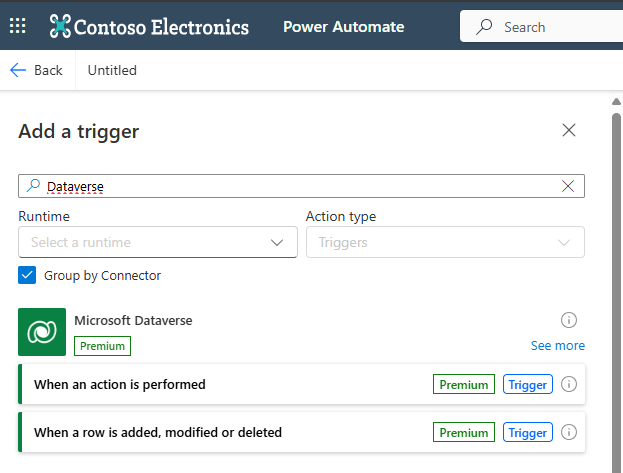
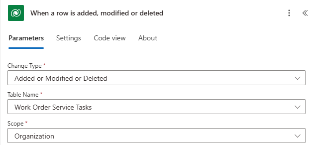
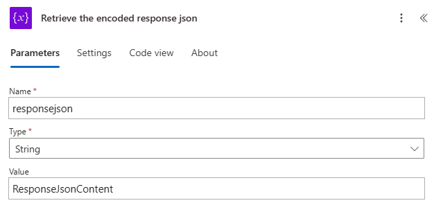
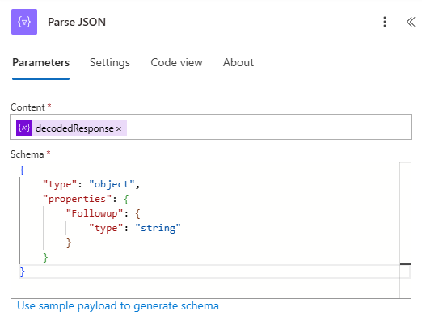

# Run reports on inspection responses

Create reports or dashboards, for example, in Power BI to analyze and act based on the inspection responses provided by technicians.

All responses entered for an inspection are stored in Microsoft Dataverse and can be parsed into individual question responses.

The questions and responses are saved into the following Dataverse tables:

- **Customer Voice survey question** or 'msfp_question': Each inspection question.
- **Customer Voice survey response** or 'msfp_surveyresponse': A response to an inspection.
- **Customer Voice survey question response** or 'msfp_questionresponse'**': Each individual response to each inspection question.

## Enable analysis on inspection responses

Configure how often inspection response should be parsed and organized in a Dataverse table.

1. In Field Service, change to the **Settings** area.
1. Go to **Field Service Settings** and select the **Inspection** tab.
1. Make sure **Analytics enabled** is set to **Yes**.
1. For **Analytics frequency**, select how often to parse inspection responses:

   - **Daily**: Daily based on the **Record generation start time**.
   - **Immediately**: As soon as an inspection is marked complete.
   - **Custom**: A custom frequency upi define between one and 365 days.

   > [!Note]
   > When analytics frequency is set to **Immediately**, the inspection response is parsed and persisted as soon as the service task is completed; the parsed responses won't be updated even if the technician makes changes and completes the inspection again. However, if the analytics frequency is set to **Daily** or **Custom**, the responses are stored from the latest completion of the service task *before* the flow start time.

## View inspection questions and responses

Questions on inspections are stored in Dataverse, and can be found in the  table in Power Apps.

1. Sign in to [Power Apps](https://make.powerapps.com/).
1. Select **Tables** and then **All**.
1. Search for and select the table you want to view. For example,**Customer Voice question response**. This table is empty until an inspection is completed

> [!div class="mx-imgBorder"]
> 

## Out-of-box flows

All the logic described in the previous section uses Power Automate flows, and comes with the inspections capability.

The following flows are involved:

1. **Deserialization of Inspection Definition Flow**: this flow gets triggered upon publish of an inspection and populates inspection questions into ```msfp_question``` table.

2. **Deserialization of Inspection Response – Recurrent Flow**: this flow triggers when frequency is set to **Daily** or **Custom** and updates the parsed inspection response JSON into ```msfp_surveyresponse``` and creates new records for responses and corresponding questions in the ```msfp_questionresponse``` table.

3. **Deserialization of Inspection Response Flow**: this flow takes care of response parsing when frequency is set to **Immediately**.

The status of the flows can be checked as shown in the following screenshot.

> [!div class="mx-imgBorder"]
> 

## Attachments or images within a response 

Each image uploaded in inspections is stored as an annotation in the *Inspection Attachments* table. They can be [retrieved using flows](#create-a-flow).

## Configuration considerations

### Use Power Automate flow to parse inspection responses (deserialization of responses)

When a technician fills out an inspection, the answers to each inspection question are stored as JSON in the **Inspection Response** entity.

> [!div class="mx-imgBorder"]
> 

Use a Power Automate flow to run a workflow on inspection responses. For more information, see the video on [run workflows on Inspection responses](https://youtu.be/fCjQmIw9ahs).

In the following example, if a technician responds "Yes" to the inspection question "Is a follow-up required?" then a new follow-up work order service task is added to the related work order.

> [!Note]
> Out-of-the-box flows cannot be customized. You must create or copy a Power Automate flow in order to customize it.

### Create a flow

Go to [https://flow.microsoft.com](https://flow.microsoft.com), sign in, choose your environment, and create a new flow.

Choose **Automated - from blank**.

> [!div class="mx-imgBorder"]
> 

Name the flow and select **Skip** to choose the trigger on the flow editor page.

> [!div class="mx-imgBorder"]
> 

 
### Create a trigger 

Search for "Dynamics 365" in **Connectors** and choose the trigger as **When a record is created or updated**.

> [!div class="mx-imgBorder"]
> 
 
This flow relates to the **Work Order Service Task** entity because technicians view and respond to inspections from this entity. Choose **Work Order Service Tasks** for the **Entity Name**. 

> [!div class="mx-imgBorder"]
> 
 
### Fetch the response from the database

Next, we need to retrieve the inspection responses.

Add a step using the **Get record** action in "Dynamics 365." 

Choose **Inspection Responses** as the entity to get and **Inspection Response ID** in the item identifier because this field has the ID of the inspection response record.

> [!div class="mx-imgBorder"]
> 
 
### Extract the JSON

Add an **Initialize Variable** action to retrieve the response from **ResponseJsonContent** field.

> [!div class="mx-imgBorder"]
> 
 
### Decode the response

Now we need to convert the response's JSON into a usable format.

Add an **Initialize Variable** action to url decode and base 64 decode the response JSON:

```decodeUriComponent(decodeBase64(variables('responseJson')))```

> [!div class="mx-imgBorder"]
> 

### Update the schema

Provide the schema with the name of the question you want to run a workflow on.

In our example, the schema is:

```
{
    "type": "object",
    "properties": {
        "Followup": {
            "type": "string"
        }
    }
}
```

> [!div class="mx-imgBorder"]
> 

If you're having trouble generating the schema, you can select the **Generate from sample** option and enter the name and sample answer of your inspection question and response.

In our example, we can enter:

```{"Followup":"Yes"}```

"Follow-up" comes from the inspection question's name value, as seen in the following screenshot:

> [!div class="mx-imgBorder"]
> 

### Condition-based action

Next we add a condition and action based on the response to the inspection question.

In this example, we create a **Work Order Service Task** with another **Service Task Type** in the same work order when the "Follow-up" inspection question has "Yes" as the answer.

> [!div class="mx-imgBorder"]
> 

> [!div class="mx-imgBorder"]
> 

Save and test your flow.
