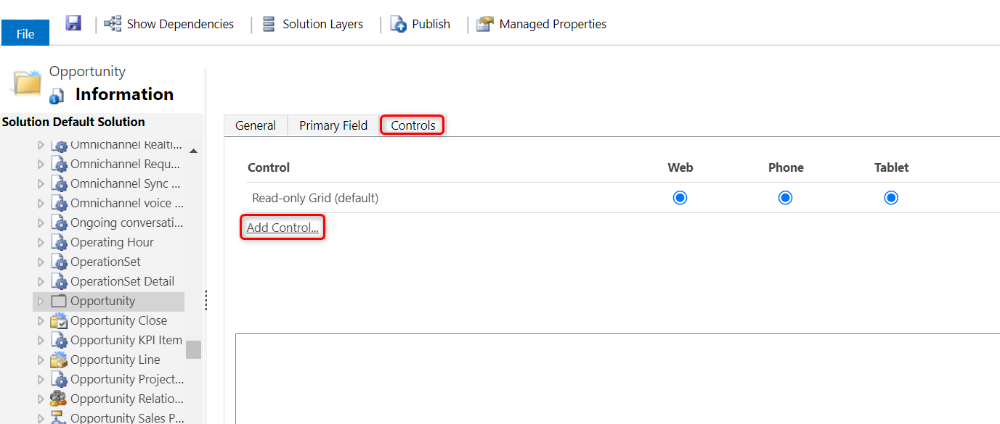
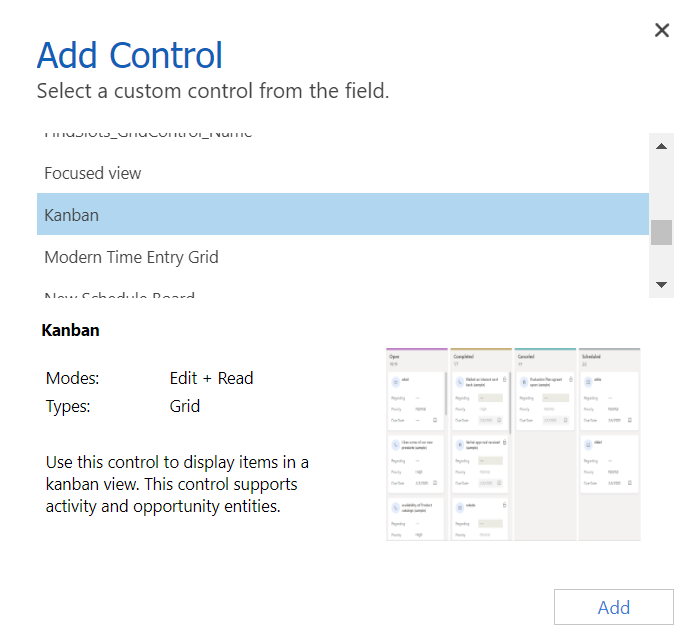

# Add the Kanban control to Opportunity or Activity tables 

Add the Kanban control to create Kanban views that help sellers to manage their opportunities or activities effectively.

## License and role requirements

| Requirement type | You must have |
|-----------------------|---------|
| **License** | Dynamics 365 Sales Premium, Dynamics 365 Sales Enterprise, or Dynamics 365 Sales Professional  More information: [Dynamics 365 Sales pricing](https://dynamics.microsoft.com/sales/pricing/) |
| **Security roles** | System Administrator   More information: [Predefined security roles for Sales](security-roles-for-sales.md)|

## Add the Kanban controls

Kanban views help salespeople to manage their opportunities and activities effectively. Add the Kanban control to the Opportunity and Activity entity so salespeople can use the Kanban views. Similar to other custom controls, Kanban control is supported on all views.

> [!IMPORTANT]
> - The Kanban control works only on the Opportunity and Activity tables.
> - The Kanban control is supported only on the main grid. It isn't currently supported on subgrids.
> - The Kanban control is not supported in the **Dynamics 365 for Phones** mobile app.

To add the control:

1. In your sales app, select the **Settings** icon, and then select **Advanced Settings**.

    > [!div class="mx-imgBorder"]  
    > 

    The **Power Platform Environment Settings** page opens in a new browser tab.

2. From the sitemap, select **Customizations** > **Customize the System**.
   The Power Apps Maker portal opens in a new browser tab.

3. Select **Tables** and then search and select the **Opportunity** or **Activity** table.

4. Select **Views** and then select any public view. You can filter public views from the **View type** dropdown list.

   :::image type="content" source="media/activity-public-views.png" alt-text="Screenshot of the Activity public views."::: 

5. Select a view and then select **Components**.
1. In the Components dialog, select **Add Component**. 
    
    :::image type="content" source="media/add-component.png" alt-text="Screenshot of the Add Component dialog with the list of components.":::
    
    If you don't see **Kanban** in the list, follow these steps:
 
    1. Select **Get more components**. 
    1. Select the **Built by Microsoft** tab and search for **Kanban**. 
    1. Select **Kanban** and then select **Add**.

1. Select **Kanban** and then select the surfaces where you want to show the Kanban control by default.

    :::image type="content" source="media/make-kanban-view-default.png" alt-text="Screenshot of the Edit kanban flyer with Web, Mobile, and Tablet selected.":::

9. To publish the changes you've made, select **Save and Publish**.

## Add the Kanban control using the legacy web client

If you haven't turned on the new experience, you can add the Kanban control using the legacy web client.

1. In your sales app, select the **Settings** icon, and then select **Advanced Settings**.

    > [!div class="mx-imgBorder"]  
    > 

    The **Business Management settings** page opens in a new browser tab.

2. On the navigation bar, select **Settings** and then under **Customization**, select **Customizations**.

3. Select **Customize the System**.

4. Under **Components** in the solution explorer, expand **Entities** and then select **Opportunity** or **Activity**.

5. Go to the **Controls** tab and select **Add Control**.

    > [!div class="mx-imgBorder"]  
    > 

6. In the **Add Control** dialog box, select **Kanban** and then select **Add**.

    > [!div class="mx-imgBorder"]  
    > 

    The Kanban control is added to the list of controls.

7. The Read-only grid is the default option, so when users select **Opportunities** from the site map, they see a read-only grid of opportunities. To make the Kanban view the default view instead, select the radio button for the Kanban control for the corresponding options.  

8. Select **Save** to save your changes.

9. To publish the changes you've made, select **Publish**.

## What you can't customize?

There are a few customization restrictions that you should be aware of:

- You can't add or remove fields from the cards in the Kanban view swim lanes.
- It isn't possible to have a role-based Kanban view.
- The Activity Kanban view is only available for the Status field. You can't configure the Activity Kanban view for an option set field other than 'Status'.
- For Opportunity Kanban view:

    - While you can customize the out-of-the-box 'Opportunity Sales Process' business process flow, you can't customize the Kanban view to use a business process flow other than the Opportunity Sales Process. 
    - The Status-based Opportunity Kanban view is only available for the Status field. You can't configure this Kanban view for an option set field other than 'Status'.
    - In the Opportunity Kanban view, aggregation is supported only for the Estimated Revenue field of the Opportunity entity. You can't configure the Kanban view to have aggregation done on other fields.
    
[!INCLUDE[cant-find-option](../includes/cant-find-option.md)]

### See also

[Work with opportunities in the Kanban view](opportunity-kanban-view.md)  

[Work with activities in the Kanban view](activity-kanban-view.md)

[!INCLUDE[footer-include](../includes/footer-banner.md)]
