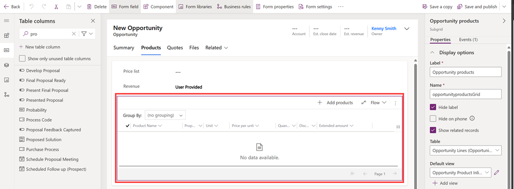

# Add editable Products grid to Opportunity, Quote, Order, and Invoice forms 

Editable products grid on the Opportunity, Quote, Order, or Invoice forms lets sellers to edit product details inline, without having to open individual product records to update. 

## License and role requirements
| Requirement type | You must have |  
|-----------------------|---------|
| **License** | Dynamics 365 Sales Premium, Dynamics 365 Sales Enterprise, or Dynamics 365 Sales Professional  More information: [Dynamics 365 Sales pricing](https://dynamics.microsoft.com/sales/pricing/) |
| **Security roles** | System Administrator   More information: [Predefined security roles for Sales](security-roles-for-sales.md)|

## Enable editable Products grid

Currently, the preconfigured Products grid is available only on apps built on the Unified Interface framework and is optimized to work on the web.

The product editable grid is added out-of-the-box to the **Product Line Items** section of the Opportunity form of type **Main**. For Quote, Order, or Invoice, it is added to the Products section of the forms of type **Main**. 

If you’re upgrading to the latest version and you’ve made customizations to the **Product Line Items** or **Products** sections of these forms, your customizations will prevail, and the product editable grid won’t be added to the forms by default. You must manually enable the product editable grid, though the product grid configurations for the editable grid already will be defined. If there are no customizations to these sections, the Products grid will be automatically configured and enabled after the upgrade. 

To enable the editable products grid on the Opportunity, Quote, Order, or Invoice form:

1. In your app, select the **Settings** icon, and then select **Advanced Settings**. 

    > [!div class="mx-imgBorder"]  
    > 

    The **Business Management settings** page opens in a new browser tab.
   > [!NOTE]
   > The **Advanced Settings** page is moving from the web client to an Unified Interface app. If your organization has enabled the public preview of the **Advanced settings redirection** feature you’ll see the settings open in the Power Platform Environment Settings app. Find more information about the app and navigation path in [Advanced settings in the new experience](advanced-settings-new-experience.md).

2. On the navigation bar, select **Settings** and then under **Customization**, select **Customizations**.

2. Select **Customize the System** to open the default solution. 

3. Under **Components**, expand **Entities**, expand the entity you want, and then select **Forms**. 

4. In the list of forms, open the form of type Main.

5. If you’re enabling the editable product grid in the Opportunity form, select the **Opportunity Products** area in the **Product Line items** section, and in the **Edit** group, select **Change Properties**.

    
    
    **– OR –** 
    
    If you’re enabling the editable product grid in the Quote, Order, or Invoice form, select the **Products** area in the **Products** section, and in the **Edit** group, select **Change Properties**.
  
    

6.	In the **Set Properties** dialog box, select the devices on which you want the editable grid to be available by selecting the corresponding radio button. Currently, the editable grid is optimized to work on the web.

    

    Notice that the properties of the editable grid such as Grid view or Nested grid view are preconfigured by default.
 
7.	Select **OK**.

[!INCLUDE [cant-find-option](../includes/cant-find-option.md)]

## Related information  

[Make model-driven app views editable using the editable grid control](/powerapps/maker/model-driven-apps/make-grids-lists-editable-custom-control)

[!INCLUDE[footer-include](../includes/footer-banner.md)]

