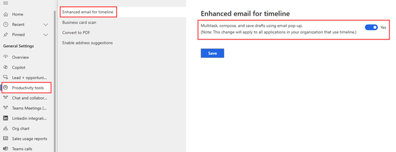

# Set up enhanced email 

Set up the enhanced email experience so sales reps can compose and send email without leaving the context of what they are working on.

> [!IMPORTANT]
> The enhanced email experience is available only for email activities created from the **Timeline** section of any model-driven app. 

## License and role requirements
| Requirement type | You must have |
|-----------------------|---------|
| **License** | Dynamics 365 Sales Premium, Dynamics 365 Sales Enterprise, or Dynamics 365 Sales Professional  More information: [Dynamics 365 Sales pricing](https://dynamics.microsoft.com/sales/pricing/) |
| **Security roles** | System Administrator   More information: [Predefined security roles for Sales](security-roles-for-sales.md)|

## Enable the enhanced email

Depending on the Dynamics 365 Sales license you have, select one of the following tabs for specific information: 

# [Sales Premium and Sales Enterprise](#tab/SE)

If you have the Sales Hub app, follow the instructions in this tab. Otherwise, follow the instructions in the **Sales Professional** tab to configure the option in Power Platform.

1. At the bottom of the site map, select **Change area**  and then select **App Settings**.

2. In the site map, select **Overview**.

3. On the **Overview** page, under **Productivity tools**, select **Manage** for **Enhanced email for timeline**.

    > [!div class="mx-imgBorder"]
    > 

4. On the **Productivity tools** page, move the **Enhanced email for timeline** toggle to **Yes**.

    > [!div class="mx-imgBorder"]
    > 

5. Select **Save**.

# [Sales Professional](#tab/SP)

If you're using a custom app or Sales Professional app, you can enable or disable the enhanced experience from **System Settings** in Power Platform.

1. In your app, select the **Settings** icon, and then select **Advanced Settings**.
 For the new experience, see the navigation in [Advanced settings in the new experience](advanced-settings-new-experience.md).

    > [!div class="mx-imgBorder"]
    > 

    The **Business Management** page opens in a new browser tab.

2. On the navigation bar, select **Settings**, and then under **System**, select **Administration**.

3. Select **System Settings**.

4. On the **System Settings** window, go to the **Email** tab, and select **Multitask, compose, and save drafts using email pop-up windows when creating email from timeline**.

    > [!div class="mx-imgBorder"]
    > 

5. Select **Ok**.
---

## Considerations 

The following considerations apply to the enhanced email experience:

- The enhanced email popup requires a screen size of at least 600 x 840 pixels. If the screen size is smaller, the general email composer will be displayed. Also, the email popup with enhanced experience in not supported on mobile phones.

- Navigating to other records is not possible when you open the enhanced email popup. 

- You can open up to three email popups simultaneously. 

[!INCLUDE[cant-find-option](../includes/cant-find-option.md)]

## Related information

[Send email using the enhanced email experience](enhanced-email.md)

[!INCLUDE[footer-include](../includes/footer-banner.md)]

