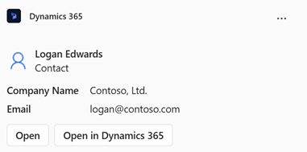

# Share Dynamics 365 records within Microsoft Teams conversations (production-ready preview)

[!INCLUDE [cc-beta-prerelease-disclaimer](../../includes/cc-beta-prerelease-disclaimer.md)]

Discussing a particular opportunity on Teams? Share the record of the chat conversation and let participants view it without navigating away from Teams. You can share any Dynamics 365 record on Teams channels and chat conversations.

## License and role requirements

| Requirement type | You must have |
|-----------------------|---------|
| **License** | <ul><li>Dynamics 365 Sales Premium, Dynamics 365 Sales Enterprise, Dynamics 365 Sales Professional, Dynamics 365 Team Members, or any Dynamics 365 customer engagement app license</li> <li>Microsoft Teams license</li></ul>   More information: <ul><li>[Dynamics 365 Sales pricing](https://dynamics.microsoft.com/sales/pricing/)</li><li>[Microsoft Teams pricing](https://www.microsoft.com/microsoft-teams/compare-microsoft-teams-options?activetab=pivot:primaryr2&rtc=1)</li><li>[Dynamics 365 Team Members](/dynamics365/get-started/team-members-license)</li><li>[Dynamics 365 Licensing Guide](https://go.microsoft.com/fwlink/?LinkId=866544&clcid=0x409)</li></ul> |
| **Security roles** | <ul><li>Any primary sales role, such as salesperson, or sales manager</li><li>Any role that has access to a Dynamics 365 record</li></ul>    More information: [Primary sales roles](../security-roles-for-sales.md#primary-sales-roles)|

## Share a Dynamics 365 record through search

As a sender, you can share records using search in the app. The search displays the record name and the table type in the search results. However, if you want to search records as per a table type and preview a record in the search results, you must use the advanced search functionality.

> [!NOTE]
> You can also share a record by typing `@Dynamics 365` followed by a message to the Dynamics 365 app during a Teams conversation. The app allows you to search for the record and then it shares the record on your behalf in the Teams conversation. For example, if you type `@Dynamics 365, help me find the Alpine deal`, the app responds with a message to search for the record. You can then search for the record and share it.

**To share a record using search:**

1.  Go to the new or an existing conversation in which you want to share a record, and then [open the Dynamics 365 app](access-d365-app.md#access-the-dynamics-365-app).

2.  In the **Dynamics 365** window, search for the record to share, and then select it to share as a card on the chat.

    > [!NOTE]
    > -   By default, the recently accessed records are displayed, without performing any search. You can either search for the record or use the record type tabs available above the search field to search for a particular record type.
    > -   The **All** tab allows you to search for all table type (out-of-the-box and custom) records. Other tabs are specific to a table type and allow you to search for that record type.    
    
    
    
    The selected record is shared on the Teams chat.
    
    

**To share a record using advanced search:**

1.  Go to the new or existing conversation in which you want to share a record, and then [open the Dynamics 365 app](access-d365-app.md#access-the-dynamics-365-app).

2.  Select **Action Commands** (**…**) in the upper-right corner, and then select **Advanced search**.

    

3.  In the **Advanced search** window, enter or select the following values:

    - **Search for a record to share**: Name of the record to share.

    - **Filter by**: Record type to search for.

    

4.  From the results, preview a record by selecting the down arrow next to the record name. Select a record to share it as a card on the chat.

    

If you see a disclaimer while sharing a record over Teams, it means that the app isn't yet added for that conversation or team.

You can still share the record over Teams. The recipients must add the Dynamics 365 app to their Teams.

## Share a record through URL

You can also share a record by pasting the URL of a Dynamics 365 record. You can get the URL of a record from the web browser.

The record is displayed as an information card with actions.

## Related information

[Share and update Dynamics 365 records within Microsoft Teams conversations](share-d365-record-overview.md)   
[Access the Dynamics 365 app through messaging extensions](access-d365-app.md)   
[Edit settings of the Dynamics 365 app](edit-d365-app.md)    
[Share feedback](share-feedback-d365-app.md)    
[View and update record details](view-update-dynamics-records.md)   
[Add chat messages to Dynamics 365 as notes or tasks](add-chat-d365.md)   
