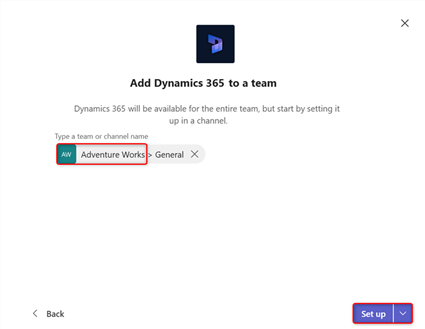
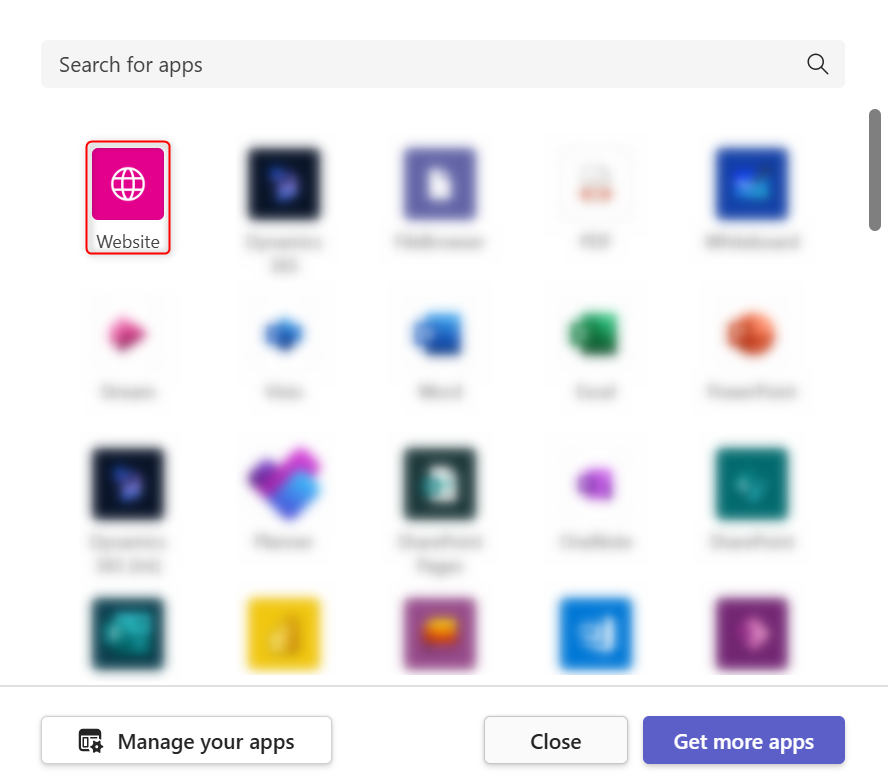
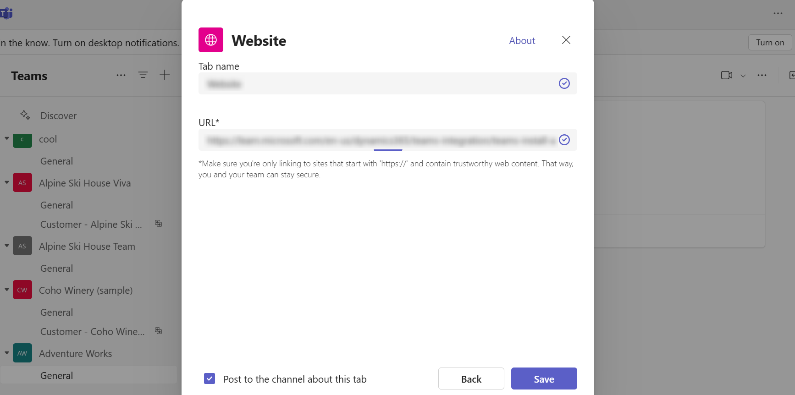

# Install the Dynamics 365 app and set up the Microsoft Teams collaboration channel tab

1. In Microsoft Teams, select **Store**.

2. Search for **Dynamics**, and then select the **Dynamics 365** tile.

3. Verify that **Add for you** and **Add to a Team** are set to **Yes**.

   You can use the Dynamics 365 app or use a Microsoft Teams channel to collaborate with others. If you have an existing Microsoft Teams channel, select both options. Otherwise, you can install the app for your personal use and install it for your Microsoft Teams later.

4. For **Add to a Team**, choose a Team and then select **Install**.

5. Pick a channel in Microsoft Teams to connect to an app record and then select **Set up**.

   > [!div class="mx-imgBorder"] 
   > 

6. Select the appropriate environment and the application you want to connect, then select **Save Changes**.

   > [!div class="mx-imgBorder"] 
   > 

   > [!NOTE]
   > - Only environments that contain customer engagement apps (such as Dynamics 365 Sales and Dynamics 365 Customer Service) appear in the list. Also, only active environments (those that are not disabled or provisioning) are displayed. 
   > - Only Unified Interface apps are listed.
   > - Only app modules licensed for the selected environment are listed. 

7. Select **Entity Selection** or **View Selection**.

    1. **Entity Selection**: Select an entity to connect. You can pick a recently viewed record or use search to find records. You can use **Filter ** to narrow the search to an entity type. Once you've picked a record, select **Save**.

    2. **View Selection**: Select an entity to see the list of available views. Once you've picked a view, select **Save**.
   
      > [!NOTE]
   > If you select a personal view (**My Views**) instead of **System Views**, it’s recommended that you share the view with other users before you add the view to the Microsoft Teams channel. Otherwise, other team members will not have access to the view tab content.

8. After completing the above steps, you'll see a new Dynamics 365 tab in the selected team channel. 
 
See [Collaborate with Microsoft Teams](teams-collaboration.md#have-a-conversation) for information on how you can use the tab feature to collaborate with Dynamics 365 apps.

## Government GCC environment 

Teams integration with Dynamics 365 isn't available for Government GCC environments. However, there's a workaround to view records using the Website app in Teams and then adding it as a tab.

1. Open a Teams channel and select **Add a tab**.

2. Search for the **Website** app and add it.

  > [!div class="mx-imgBorder"] 
  > 
  
> [!NOTE]
> If you don't see the **Website** app in Teams, ask your administrator to enable this option through the [Microsoft 365 admin center](/microsoft-365/admin/admin-overview/about-the-admin-center).

3. Enter a name for the tab and the URL for your Dynamics 365 app and then select **Save**.

  > [!div class="mx-imgBorder"] 
  > 

### See also  
 [Troubleshoot Microsoft Teams integration](teams-troubleshoot.md)

[!INCLUDE[footer-include](../includes/footer-banner.md)]
